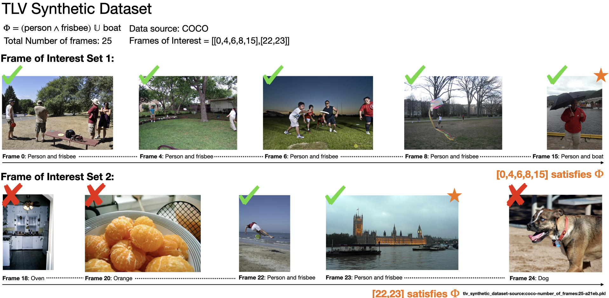

# Temporal Logic Video (TLV) Dataset

[![Contributors][contributors-shield]][contributors-url]
[![Forks][forks-shield]][forks-url]
[![Stargazers][stars-shield]][stars-url]
[![MIT License][license-shield]][license-url]
<!-- PROJECT LOGO -->
<br />
<div align="center">
  <a href="https://github.com/UTAustin-SwarmLab/temporal-logic-video-dataset">
    
  </a>

  <h3 align="center">Temporal Logic Video (TLV) Dataset</h3>

  <p align="center">
    Synthetic and real video dataset with temporal logic annotation
    <br />
    <a href="https://github.com/UTAustin-SwarmLab/temporal-logic-video-dataset"><strong>Explore the docs »</strong></a>
    <br />
    <br />
    <a href="https://anoymousu1.github.io/nsvs-anonymous.github.io/">NSVS-TL Project Webpage</a>
    ·
    <a href="https://github.com/UTAustin-SwarmLab/Neuro-Symbolic-Video-Search-Temploral-Logic">NSVS-TL Source Code</a>
  </p>
</div>

## Overview

The Temporal Logic Video (TLV) Dataset addresses the scarcity of state-of-the-art video datasets for long-horizon, temporally extended activity and object detection. It comprises two main components:

1. Synthetic datasets: Generated by concatenating static images from established computer vision datasets (COCO and ImageNet), allowing for the introduction of a wide range of Temporal Logic (TL) specifications.
2. Real-world datasets: Based on open-source autonomous vehicle (AV) driving datasets, specifically NuScenes and Waymo.

## Table of Contents

- [Dataset Composition](#dataset-composition)
- [Dataset (Release)](#dataset)
- [Installation](#installation)
- [Usage](#usage)
- [Data Generation](#data-generation)
- [Contribution Guidelines](#contribution-guidelines)
- [License](#license)
- [Acknowledgments](#acknowledgments)

## Dataset Composition

### Synthetic Datasets
- Source: COCO and ImageNet
- Purpose: Introduce artificial Temporal Logic specifications
- Generation Method: Image stitching from static datasets

### Real-world Datasets
- Sources: NuScenes and Waymo
- Purpose: Provide real-world autonomous vehicle scenarios
- Annotation: Temporal Logic specifications added to existing data

## Dataset 
<div align="center">
  <a href="https://github.com/UTAustin-SwarmLab/temporal-logic-video-dataset">
    
  </a>
</div>

Though we provide a source code to generate datasets from different types of data sources, we release a dataset v1 as a proof of concept. 

### Dataset Structure

We provide a v1 dataset as a proof of concept. The data is offered as serialized objects, each containing a set of frames with annotations.

#### File Naming Convention
`\<tlv_data_type\>:source:\<datasource\>-number_of_frames:\<number_of_frames\>-\<uuid\>.pkl`

#### Object Attributes
Each serialized object contains the following attributes:
- `ground_truth`: Boolean indicating whether the dataset contains ground truth labels
- `ltl_formula`: Temporal logic formula applied to the dataset
- `proposition`: A set of proposition for ltl_formula
- `number_of_frame`: Total number of frames in the dataset
- `frames_of_interest`: Frames of interest which satisfy the ltl_formula
- `labels_of_frames`: Labels for each frame
- `images_of_frames`: Image data for each frame

You can download a dataset from here. The structure of dataset is as follows: serializer
   ```
   ILSVRC/
   ├── Annotations/
   ├── Data/
   ├── ImageSets/
   └── LOC_synset_mapping.txt
   ```

## Installation

```bash
python -m venv .venv
source .venv/bin/activate
python -m pip install --upgrade pip build
python -m pip install --editable ."[dev, test]"
```

### Prerequisites

1. ImageNet (ILSVRC 2017):
   ```
   ILSVRC/
   ├── Annotations/
   ├── Data/
   ├── ImageSets/
   └── LOC_synset_mapping.txt
   ```

2. COCO (2017):
   ```
   COCO/
   └── 2017/
       ├── annotations/
       ├── train2017/
       └── val2017/
   ```

## Usage

Detailed usage instructions for data loading and processing.

### Data Loader Configuration

- `data_root_dir`: Root directory of the dataset
- `mapping_to`: Label mapping scheme (default: "coco")
- `save_dir`: Output directory for processed data

### Synthetic Data Generator Configuration

- `initial_number_of_frame`: Starting frame count per video
- `max_number_frame`: Maximum frame count per video
- `number_video_per_set_of_frame`: Videos to generate per frame set
- `increase_rate`: Frame count increment rate
- `ltl_logic`: Temporal Logic specification (e.g., "F prop1", "G prop1")
- `save_images`: Boolean flag for saving individual frames

## Data Generation

### COCO Synthetic Data Generation

```bash
python3 run_scripts/run_synthetic_tlv_coco.py --data_root_dir "../COCO/2017" --save_dir "<output_dir>"
```

### ImageNet Synthetic Data Generation

```bash
python3 run_synthetic_tlv_imagenet.py --data_root_dir "../ILSVRC" --save_dir "<output_dir>"
```

Note: ImageNet generator does not support '&' LTL logic formulae.

## License

This project is licensed under the MIT License. See the [LICENSE](LICENSE) file for details.

## Citation
If you find this repo useful, please cite our paper:
```bibtex
@inproceedings{Choi_2024_ECCV,
  author={Choi, Minkyu and Goel Harsh and Omama, Mohammad and Yang, Yunhao and Shah, Sahil and Chinchali and Sandeep},
  title={Towards Neuro-Symbolic Video Understanding},
  booktitle={Proceedings of the European Conference on Computer Vision (ECCV)},
  month={September},
  year={2024}
}
```


[contributors-shield]: https://img.shields.io/github/contributors/UTAustin-SwarmLab/temporal-logic-video-dataset.svg?style=for-the-badge
[contributors-url]: https://github.com/UTAustin-SwarmLab/temporal-logic-video-dataset/graphs/contributors
[forks-shield]: https://img.shields.io/github/forks/UTAustin-SwarmLab/temporal-logic-video-dataset.svg?style=for-the-badge
[forks-url]: https://github.com/UTAustin-SwarmLab/temporal-logic-video-dataset/network/members
[stars-shield]: https://img.shields.io/github/stars/UTAustin-SwarmLab/temporal-logic-video-dataset.svg?style=for-the-badge
[stars-url]: https://github.com/UTAustin-SwarmLab/temporal-logic-video-dataset/stargazers
[license-shield]: https://img.shields.io/github/license/UTAustin-SwarmLab/temporal-logic-video-dataset.svg?style=for-the-badge
[license-url]: https://github.com/UTAustin-SwarmLab/temporal-logic-video-dataset/blob/master/LICENSE.txt
